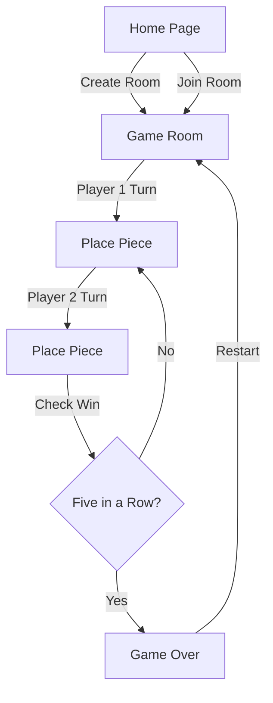

## 1. Product Overview
一款UI唯美的五子棋游戏，支持双人在线对战，提供优雅的游戏体验。
- 解决传统五子棋缺乏美观界面和便捷在线对战的问题
- 目标用户为喜欢休闲益智游戏的朋友和家人

## 2. Core Features

### 2.1 User Roles
| Role | Registration Method | Core Permissions |
|------|---------------------|------------------|
| Player | No registration needed | Join/Create game room, place pieces, chat |

### 2.2 Feature Module
1. **Game page**: Chessboard, player info, game controls, chat
2. **Home page**: Room creation, room list

### 2.3 Page Details
| Page Name | Module Name | Feature description |
|-----------|-------------|---------------------|
| Home page | Room list | Display available game rooms, join existing rooms |
| Home page | Create room | Create new game room with custom name |
| Game page | Chessboard | Interactive 15x15 board, place pieces, show winning line |
| Game page | Player info | Display player names, turn indicator, piece color |
| Game page | Game controls | Restart game, undo move, leave room |
| Game page | Chat | Real-time text chat between players |

## 3. Core Process
用户进入首页 → 创建或加入游戏房间 → 双方轮流落子 → 五子连珠获胜 → 可重新开始游戏

## 4. User Interface Design
### 4.1 Design Style
- Primary colors: Deep forest green (#1a4d2e) and soft gold (#e8b86d)
- Secondary colors: Warm off-white (#f5f0e6) and charcoal gray (#333333)
- Button style: Rounded rectangles with subtle shadow and hover lift animation
- Fonts: Playfair Display (headings), Inter (body)
- Layout style: Centered, card-based with generous spacing
- Icon style: Simple, elegant SVG icons

### 4.2 Page Design Overview
| Page Name | Module Name | UI Elements |
|-----------|-------------|-------------|
| Home page | Hero section | Gradient background, glowing title, floating particles |
| Home page | Room list | Glassmorphism cards, smooth hover effects |
| Game page | Chessboard | Wooden texture, subtle grid lines, animated piece placement |
| Game page | Player info | Color-coded avatars, pulse animation for current turn |

### 4.3 Responsiveness
- Desktop-first design with mobile adaptation
- Touch-optimized for mobile devices
- Adaptive board size based on screen dimensions

### 4.4 Animation and Effects
- Piece placement with smooth fade-in and scale animation
- Winning line with glowing highlight effect
- Turn indicator with pulse animation
- Chat messages with slide-in transition
